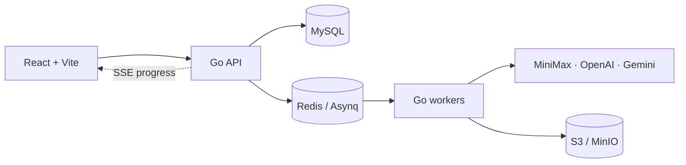

# Framescape 帧境

[](https://github.com/A11MiND/Framescape/actions/workflows/ci.yml) · [](https://framescape.up.railway.app)

Framescape is an AI creation workspace for images, comics, and video. Turn a
structured idea, reference images, and reusable characters into generation
jobs that can be reviewed, edited, exported, and reused as new assets.

帧境是一个图片、漫画和视频创作工作台。用户可以把故事、参考图和角色
组合成任务，逐步审核、编辑、导出，并把结果保存为可复用素材。

## See it in action / 快速预览

The repository includes a small, self-contained demo so the project page can
be viewed without a separate asset host.

仓库内置了演示素材，打开 GitHub 项目即可查看，不需要额外的素材服务器。


**Video demo / 视频演示:** [▶ Open the MP4 demo](web/src/demo/assets/clip-1.mp4)

The deployed review environment is available at
[framescape.up.railway.app](https://framescape.up.railway.app). Use the local
setup below for development and provider tests.

## What you can make / 支持的创作模式

| Mode | Description | 模式说明 |
| --- | --- | --- |
| `image.single` / `image.batch` | One prompt, one or up to four images | 单图或批量出图 |
| `image.comic4` | Four-panel comic with characters, dialogue, and logo references | 四格漫画，支持角色、对白和 Logo 参考图 |
| `image.sequence` | A multi-shot image sequence with continuity controls | 连续图片，支持跨镜头一致性 |
| `video.single` | Text/image-to-video, including first/last-frame references | 单段视频，支持首尾帧 |
| `video.sequence` | Multi-shot video with preview and finalize gates | 连续视频，分镜预览后再生成 |

Every job reserves credits before submission, reports progress through SSE, and
stores generated results as reusable assets. Provider errors are normalized
into stable error codes so the UI can show translated, actionable messages.

## Architecture / 架构



The API and workers are stateless and can be scaled horizontally. MySQL is the
source of truth for job state and credit reservations; a worker restart does
not resubmit a paid provider task. The `cmd/fakeprovider` service reproduces
provider latency, errors, and rate limits for local end-to-end testing without
paid calls.

## Run locally / 本地运行

### Full stack with Docker Compose

```bash
cp .env.example .env
# Fill in the required values in .env.
docker compose -f deploy/docker-compose.yml --env-file .env up -d --build
```

This starts MySQL, Redis, S3-compatible object storage, the API, workers, and
the nginx-fronted frontend on port 80.

### Development processes

```bash
set -a && source .env && set +a

go run ./cmd/api
go run ./cmd/worker

cd web
npm install
npm run dev
```

For a no-cost provider run, start the fake provider and point
`MINIMAX_BASE_URL` and `OPENAI_BASE_URL` at `http://127.0.0.1:18090` as shown in
[`.env.example`](.env.example). `make test-infra-up` starts disposable
MySQL, Redis, and MinIO services for backend tests.

## Configuration / 配置

Copy `.env.example` to `.env` and `web/.env.example` to `web/.env`. Required
values include the MySQL and Redis connections, `JWT_SECRET`, object-storage
credentials, and provider keys. Optional Google OAuth and phone/email login
variables are documented inline in the example files.

Never commit `.env`, provider keys, or generated diagnostic output.

## Test and build / 测试与构建

```bash
go build ./...
go vet ./...
go test -race ./...

cd web
npm run lint
npm run build
npm test
```

The GitHub Actions workflow runs the backend and frontend checks on every push
to `main` and on pull requests. The backend CI uses a pinned, community
LocalStack S3 image so tests do not depend on a withdrawn MinIO image or a
private registry license.

Phase 7 local checks are also available:

```bash
node scripts/security-review.mjs
./scripts/phase7-migration-roundtrip.sh
node scripts/phase7-load.mjs
```

## Repository map / 目录

| Path | Contents |
| --- | --- |
| `cmd/` | API, worker, migration, CLI, and fake-provider entry points |
| `internal/domain/` | Plans, statuses, capabilities, and prompt compilation |
| `internal/application/` | Jobs, workflows, credits, community, and upkeep |
| `internal/infra/` | Orchestration, persistence, providers, storage, and cache |
| `internal/interfaces/http/` | Gin handlers, auth, SSE, and API errors |
| `web/` | React + TypeScript frontend and demo assets |
| `migrations/` | Goose database migrations |
| `deploy/` | Dockerfiles, Compose, nginx, and observability configuration |

## License and status / 状态

Framescape is under active development. Check the commit history and CI badge
before deploying a branch. Production deployment is intentionally separate from
local development; verify environment variables and storage persistence before
promoting a release.
